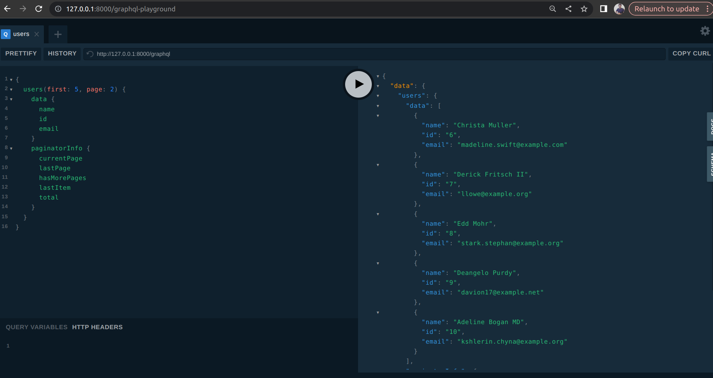
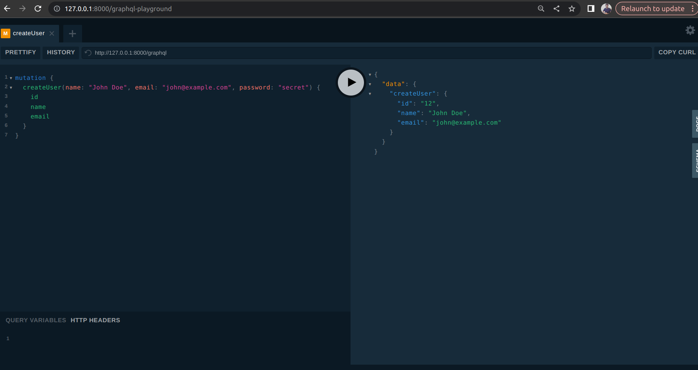
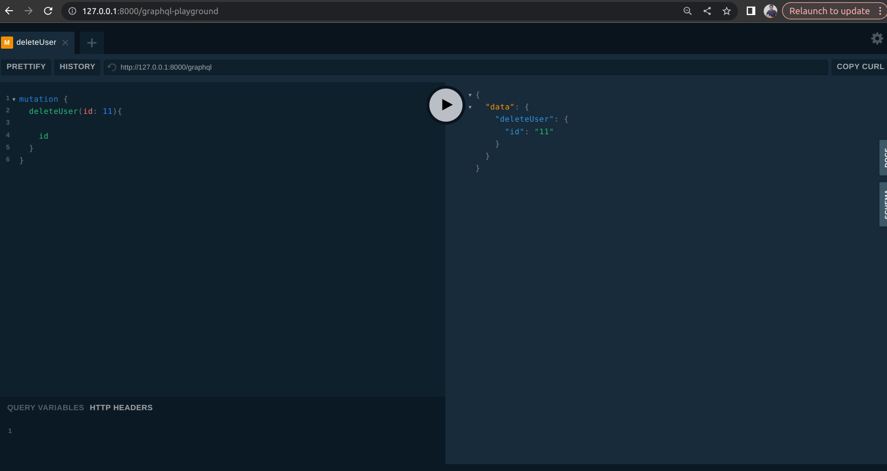

# Project Title

Briefly describe the purpose of the project.

I have completed the task based on your instructions. Here's a summary of what I used:

- **Framework**: Laravel (MVC) in PHP
- **Database**: MySQL
- **Package**: Lighthouse

I have also attached a demo video and included the GitHub repository with the source code. I’m looking forward to your feedback.

---

To create a `README.md` file for your GitHub repository that includes GraphQL queries and mutations, along with images, here's a template you can follow:

---


## Table of Contents
- [Queries](#queries)
- [Mutations](#mutations)
- [Images](#images)

## Queries

### Fetch Users

This query fetches users with pagination. It retrieves the first 5 users on the second page, along with pagination information.

```graphql
{
  users(first: 5, page: 2) {
    data {
      name
      id
      email
    }
    paginatorInfo {
      currentPage
      lastPage
      hasMorePages
      lastItem
      total
    }
  }
}
```

### Response Example:
```json
{
  "data": {
    "users": {
      "data": [
        {
          "name": "John Doe",
          "id": 1,
          "email": "john@example.com"
        },
        {
          "name": "Jane Smith",
          "id": 2,
          "email": "jane@example.com"
        }
      ],
      "paginatorInfo": {
        "currentPage": 2,
        "lastPage": 3,
        "hasMorePages": true,
        "lastItem": 10,
        "total": 15
      }
    }
  }
}
```

## Mutations

### Create a New User

This mutation creates a new user.

```graphql
mutation {
  createUser(name: "John Doe", email: "john@example.com", password: "secret") {
    id
    name
    email
  }
}
```

### Update a User

This mutation updates an existing user's details.

```graphql
mutation {
  updateUser(name: "Sathis", email: "sathish@gopi.com", id: 11) {
    id
    name
    email
  }
}
```

### Delete a User

This mutation deletes a user by ID.

```graphql
mutation {
  deleteUser(id: 6) {
    id
  }
}
```

## Images


### Screenshot 1


### Screenshot 1


### Screenshot 1


